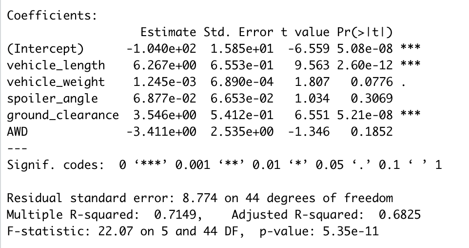

# MechaCar_Statistical_Analysis

## Linear Regression to Predict MPG

In this section of the project, knowledge of R was used for designing a linear model that predcits the mpg of MechaCar prototypes using various variables from the MechaCar dataset. Linear regression is considered to be a statistical model used for predicting a continuous dependent variable based on various independent variables fitted to the equation fo line. As it can be seen in the figure below, our resulting model is as follow:

**mpg = 6.267vehicle_length + 0.001245vehicle_weight + 0.06877spoiler_angle + 3.546ground_clearance - 3.411AWD - 104**

Looking at the multiple linear regression results as shown in the figure below, the following can be addressed:

- The variables that provided a non-random amount of variance to the mpg value values in the dataset are vehicle_length and ground_clearance due to their low p-values. As a resuslt of this, these variables are found to have less random variance to the linear model and more impact on the mpg.

- The p-value of our linear regression analysis is **5.35e-11** which is much smaller than our assumed significance level of **0.05%**. Therefore, we can state that there is a sufficient evidence to reject our null hypothesis, which means the slope of our linear model is not zero.

- The linear model can effectively predict mpg of MechaCar prototypes since the r-squared value is **0.7149** which means that approximately 71% of mpg predictions will be correct using this linear model.

## Summary Statistics on Suspension Coils

In this portion of the project, knowledge of R was used for creating a summary statistics showing the suspension coil's PSI continuous variable across all manufacturing lots as well as the mean, median, variance, and standard deviation of the PSI column for each lot using the suspension coil dataset that contained the results from multiple production lots. Furthermore, the design specifications for the MechaCar suspension coils dictate that the variance of the suspension coils must not overcome 100 pounds per square inch. Thus, as it can be seen in the figure below the current manufacturing data for all manufacturing lots meet this design specification since the variance is **62.294 PSI** which is well below the 100 PSI variance requirement.

Additionally, looking at the variances of each lot individually as demonstrated in the figure below, it can be clearly seen that lot 1 and lot 2 are both within the design specification with variances of **0.98** and **7.47** respectively. However, lot 3 is exceeding the manufacturing specidication due to its high variance of **170.29**.

## T-Tests on Suspension Coils

In this piortion of the project, t-tests were performed for determining if all the manufacturing lots and each individual lot were statistically different from the population mean of 1,500 pounds per square inch. Looking at the t-test carried out for all of the manufacturing lots as illustarted in the figure below, it can be seen that there is no enough evidence for rejecting the null hypothesis since the p-value is **0.06028** which is greater than the assumed signficance level of **0.05**. Thus, the PSI across all manufacturing lots is not statistically different from the population mean of 1,500 pounds per square inch.

Furthermore, looking at the t-test results performed for each individual lot as shwon in the figues below, the following can be seen:

- Lot 1 has a p-value of 1 which is greater than the common signficance level of 0.05, hence there is not enough evidence to reject the null hypothesis. As a result of this the sample mean and the presumed population mean of 1500 are not statistically different.

- Similar to lot 1, lot 2 has a p-value of **0.6072** which is greater than the significance level of 0.05 which means there is not enough evidence for rejecting the null hypothesis. Thus, the population mean and the sample mean are statistically similar.

- Looking at the t-test performed for lot 3, it can be seen that its p-value of **0.04168** is lower than the signficance level of 0.05, hence there is enough evidence to reject the null hypothesis and conclude that this sample mean is statistically different from the population mean of 1,500 pounds per square inch.

*Lot 1*

*Lot 2*

*Lot 3*

## Study Design: MechaCar vs Competition

In this section of the report, we will be designing a statistical study for comparing the performance of the MechaCar against performance of vehicles from other manufacturers. In order to compare the performance of the MechaCar against their competitors we need to consider the metrics that would be of interest to the customers. As a result, two of the most critical metric that would be of interest to consumers is highway fuel efficiency of a vehicle. Thus, comparing the highway fuel efificincy of MechaCar prototypes with those of their competititors would be considered as a statistical study that should be performed. 
We are required to test whether the highway fuel efficiency of the MechaCar is statistically different from their competitors or not. 

Thus, the null and alternative hypotheses can be stated as the following:

 - Null hypothesis (HO): There is no statistical difference between the prototype sample mean and the market mean.
 - Alternative hypothesis (Ha): There is a statistical difference between the prototype sample mean and the market mean.

 As a result of this, a statistical test has to be considered for testing our hypothesis. Thus, one sample t-Test is chosen as a statistical test to be performed for comparing the population of different competitor vehicles types after collecting the required data from various types of competitor vehicles that are present in the market.
 Furthermore, the data needed for running the statsitical test can be gathered from the top 10 samples of MechaCar prototypes that would be having varying specifications in terms of ground clearance and lengths of vehicle since they were earlier found to have the greatest impact on the mpg. Thus, these specifications could be compared to those of the competitor cars for identifying which vehicle would be having better fuel efficiency. Additionally, the p-value has to be evaluated agaianst the the common significance factor of 0.05 and if its found to be smaller than this factor, then there will be enough evidence that the null hypothesis can be rejected and alternative hypothesis would be stated as true.

